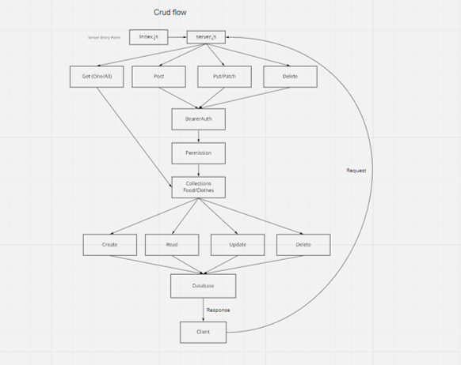
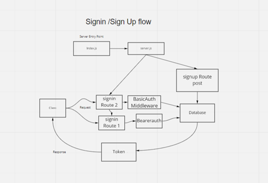

# auth-api

Created by Anthony Morton

## Installation
Express, jest, dotenv, supertest, nodemon, pg, sequelize, sequelize-cli, sqlite3, base-64, bcrypt, cors, jsonwebtoken, morgan, method-override, eslint

## Summary of Problem Domain
Being able to login is great. But controlling access at a more granular level is vital to creating a scalable system. In this lab, you will implement Role Based Access Control (RBAC) using an Access Control List (ACL), allowing to not only restrict access to routes for valid users, but also based on the individual permissions we give each user.

## Links to application deployment
signin: https://auth-bearer-anthony-morton.herokuapp.com/signin
signup: https://auth-bearer-anthony-morton.herokuapp.com/signup
secret: https://auth-bearer-anthony-morton.herokuapp.com/secret
pull: https://github.com/anthonylouismorton/bearer-auth/pull/2
actions: https://github.com/anthonylouismorton/bearer-auth/actions

## Include embedded UML

## Talk about your routes

## Routes

* HTTP POST
  * Path: /Signin
    * validates user using basic auth

    * HTTP POST
  * Path: /Signup
    * Creates new username/password in db

        * HTTP GET
  * Path: /users
    * Gets all users in db using BearerAuth middleware

    
        * HTTP GET
  * Path: /secret
    * SECRET AREA

        * HTTP GET
  * Path: /model
    * Get food/clothes from information

            * HTTP POST
  * Path: /model
    * Create food/clothes from information

                * HTTP PUT/PATCH
  * Path: /model
    * update food/clothes from information

                    * HTTP DELETE
  * Path: /model
    * delete food/clothes from information